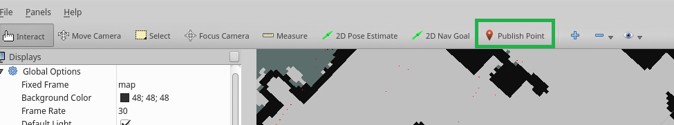

.. mydocumentation documentation master file, created by
   sphinx-quickstart on Mon Oct 21 14:40:43 2019.
   You can adapt this file completely to your liking, but it should at least
   contain the root `toctree` directive.

Welcome to Really bad documentation!
===========================================

Nothing is true, everything is permitted.
Some new content!!!
Some changes..

Need more commits!

.. toctree::
   :maxdepth: 2
   :caption: Contents:

Indices and tables
==================

* :ref:`genindex`
* :ref:`modindex`
* :ref:`search`
